## 장고 모델 (ORM)

### 애플리케이션의 다양한 데이터 저장방법

데이터베이스 : RDBMS, NoSQL 등

파일 : 로컬, 외부 정적 스토리지

캐시서버 : memcached, redis 등


### 데이터베이스와 SQL

데이터베이스의 종류

* RDBMS (관계형 데이터베이스 관리 시스템)

  PostgreSQL, MySQL, SQLite, MS-SQL, Oracle 등

* NoSQL : MongoDB, Cassandra, CouchDB, Google BigTable 등

데이터베이스에 쿼리하기 위한 언어 => SQL

* 같은 작업을 하더라도, 보다 적은 수의 SQL, 보다 높은 성능의 SQL
* 직접 SQL을 만들어내기도 하지만, ORM(Object-relational mapping)을 통해 SQL을 생성/실행하기도 함 => Not Magic.
* 중요) ORM을 쓰더라도, 내가 작성된 ORM코드를 통해 어떤 SQL이 실행되고 있는지 파악하고 이를 최적화할 수 있어야함 -> django-debug-toolbar 활용


### 장고 ORM인 모델은 RDB만을 지원

장고 3.0.2 기준으로 기본 제공되는 backends - mysql, oracle, postgresql, sqlite3

Microsoft SQL Server는 django-pyodbc-azure 라이브러리가 필요


### 다양한 파이썬 ORM (awesome-python#orm)

### Relational Databases

* Django Models, SQLAlchemy, Orator, Peewee, PonyORM 등

#### NoSQL Databases

* django-mongodb-engine, hot-redis, MongoEngine, PynamoDB 등


### 장고의 강점은 Model과 Form

장고에서도 다양한 ORM, 라이브러리 사용 가능

강력한 Model/Form

적절하게 섞어쓸 수 있음

SQL을 직접 실행할 수도 있지만, 가능하면 ORM 쓰기

직접 SQL 문자열 조합하지 말고 인자로 처리 => SQL Injection 방지

`python manage.py shell`

`from django.db import connection`

`cursor = connection.cursor()`

`cursor.close()`

`exit()`


## Django Model

### 장고 내장 ORM

<데이터베이스 테이블>과 <파이썬 클래스>를 1:1로 매핑

모델 클래스명은 단수형으로 지정 - 예: Posts (X), Post (O)

클래스이기에 첫 글자가 대문자인 PascalCase 네이밍

매핑되는 모델 클래스는 DB 테이블 필드 내역이 일치해야함

모델을 만들기 전에, 서비스에 맞게 데이터베이스 설계가 필수

이는 데이터베이스의 영역 -> 관계형 데이터베이스 학습도 필요

파이썬 클래스 정의할 때는 앱 폴더에 models.py에

```python
from django.db import models

class Post(models.Model):
    title = models.CharField(max_length=100)
    content = models.TextField()
    created_at = models.DateTimeField(auto_now_add=True)
    updated_at = models.DateTimeField(auto_now=True)
```


### 모델 활용 순서

장고 모델을 통해, 데이터베이스 형상을 관리할 경우

1. 모델 클래스 작성
2. 모델 클래스로부터 마이그레이션 파일 생성 => makemigrations 명령
3. 마이그레이션 파일을 데이터베이스에 적용 => migrate 명령
4. 모델 활용

장고 외부에서, 데이터베이스 형상을 관리할 경우

* 데이터베이스로부터 모델 클래스 소스 생성 => inspectdb 명령
* 모델 활용


### 모델명과 DB 테이블명

DB 테이블명 : 디폴트 "앱이름_모델명"

예

```
blog앱
* Post 모델 -> "blog_post"
* Comment 모델 -> "blog_comment"

shop 앱
* Item 모델 -> "shop_item"
* Review 모델 -> "shop_review"
```

커스텀 지정

* 모델 Meta 클래스의 db_table 속성

https://docs.djangoproject.com/ko/3.0/ref/models/options/#db-table


### 새로운 모델 만들기

`python manage.py startapp instagram` 

앱 만든 후 settings.py에 INSTALLED_APPS 에 추가

instagram 앱에 urls.py 만들고

```python
urlpatterns = [
]
```

플젝/urls.py에

```python
from django.contrib import admin
from django.urls import path, include

urlpatterns = [
    path('admin/', admin.site.urls),
    path('blog1/', include('blog1.urls')),
    path('instagram/', include('instagram.urls')),
]
```

앱 등록 완료 후

shop/models.py

```python
from django.db import models

class Post(models.Model):
    pass
```

```python
from django.db import models

class Post(models.Model):
    message = models.TextField()
    created_at = models.DateTimeField(auto_now_add=True)
    updated_at = models.DateTimeField(auto_now=True)
```

`python manage.py makemigrations instagram`

`python manage.py migrate instagram`

`python manage.py sqlmigrate instagram 0001_initial`  //  실제로 데이터베이스에 들어가는 쿼리를 볼 수 있다


## 적용 순서

Item 모델 정의

마이그레이션 파일 생성 `python manage.py makemigrations 앱이름`

마이그레이션 파일 적용 `python manage.py migrate`

데이터베이스 확인 - DB 종료에 따라 다양한 방법


`python manage.py dbshell`

https://www.sqlite.org/download.html

`.tables`

테이블 목록이 나옴

`.quit`

https://sqliteonline.com 혹은 https://sqlitebrowser.org 에 db.sqlite3 열기


## 장고 모델 필드

### 기본 지원되는 모델필드 타입(1)

Primary Key: AutoField, BigAutoField

문자열: CharField, TextField, SlugField

날짜/시간: DateField, TimeField, DateTimeField, DurationField

참/거짓: BooleanField, NullBooleanField

숫자: IntegerField, SmallIntegerField, PositiveIntegerField, PositiveSmallIntegerfield, BigIntegerField, DecimalField, FloatField

파일: BinaryField, FileField, ImageField, FilePathField

https://docs.djangoproject.com/en/3.0/ref/models/fields/#field-types


### 기본 지원되는 모델필드 타입(2)

이메일: EmailField

URL: URLField

UUID: UUIDField

아이피: GenericIPAddressField

Relationship Types

* ForeignKey
* ManyToManyField
* OneToOneField

그리고, 다양한 커스텀 필드들

django-model-utils: https://django-model-utils.readthedocs.io/en/latest/


### 모델필드들은 DB필드타입을 반영

#### DB에서 지원하는 필드들을 반영

* Varchar 필드타입 => CharField, SlugField, URLField, EmailField 등

#### 파이썬 데이터타입과 데이터베이스 데이터타입을 매핑

```
AutoField => int
BinaryField => bytes
BooleanField => bool
CharField/SlugField/URLField/EmailField => str  ==> 디폴트 적용된 유효성 검사 등의 차이
```

#### 같은 모델필드라 할지라도, DB에 따라 다른 타입이 될 수도 있다

DB에 따라 지원하는 기능이 모두 다름


### 자주 쓰는 필드 공통 옵션

blank: 장고 단에서 validation시에 empty 허용 여부 (디폴트: False)

null (DB 옵션): null 허용 여부 (디폴트: False)

db_index (DB 옵션): 인덱스 필드 여부 (디폴트: False)

default: 디폴트 값 지정, 혹은 값을 리턴해줄 함수 지정

* 사용자에게 디폴트값을 제공하고자 할 때

unique (DB 옵션): 현재 테이블 내에서 유일성 여부 (디폴트: False)

choices: select 박스 소스로 사용

validators: validators를 수행할 함수를 다수 지정

* 모델 필드에 따라 고유한 validators들이 등록 (ex- 이메일만 받기)

verbose_name: 필드 레이블, 미지정시 필드명이 사용

help_text: 필드 입력 도움말

```python
# 1:n 에서 n측에다가 외래키 설정
```


#### 설계한 데이터베이스 구조에 따라, 최대한 필드타입을 타이트하게 지정해주는 것이, 입력값 오류를 막을 수 있음.

blank/null 지정은 최소화 => manage.py inspect 명령을 통해 생성된 모델 코드는 초안

validators 들이 다양하게/타이트하게 지정됨

필요하다면, validators들을 추가로 타이트하게 지정

프론트엔드에서의 유효성 검사는 사용자 편의를 위해서 수행하며, 백엔드에서의 유효성 검사는 필수

직접 유효성 로직을 만들지 말고 이미 잘 구성된 Features들을 가져다 쓰기

장고의 Form/Model을 통해 지원되며, django-rest-framework의 Serializer를 통해서도 지원됨

#### ORM은 SQL 쿼리를 만들어주는 역할일 뿐, 보다 성능 높은 애플리케이션을 위해서는, 사용하려는 데이터베이스에 대한 깊은 이해가 필요


## 장고 admin을 통한 데이터 관리 (기초)

### django admin

django.contrib.admin 앱을 통해 제공

* 디폴트 경로 : /admin/ => 실제 서비스에서는 다른 주소로 변경 권장(임의의 주소로 정의해도 알아서 찾아감. URL Reverse)
* 혹은 django-admin-honeypot 앱을 통해, 가짜 admin 페이지 노출

모델 클래스 등록을 통해, 조회/추가/수정/삭제 웹UI를 제공

* 서비스 초기에, 관리도구로서 사용하기에 제격
* 관리도구 만들 시간을 줄이고, End-User 서비스에 집중!

내부적으로 Django Form을 적극적으로 사용


### 모델 클래스를 admin에 등록하기

앱/admin.py

```python
from django.contrib import admin
from .models import Item

# 등록법 #1
admin.site.register(Item)  #기본 ModelAdmin으로 동작

#등록법 #2
class ItemAdmin(admin.ModelAdmin):
    pass

admin.site.register(Item, ItemAdmin)  # 지정한 ModelAdmin으로 동작

# 등록법 #3
@admin.register(Item)
class ItemAdmin(admin.ModelAdmin):
    pass
```


instagram > admin.py

```python
from django.contrib import admin
from .models import Post

# 등록법 #1
admin.site.register(Post)  #기본 ModelAdmin으로 동작
```

위와 같이 하면 Post 뜸

or

```python
from django.contrib import admin
from .models import Post

class PostAdmin(admin.ModelAdmin):
    pass

admin.site.register(Post, PostAdmin)
```

or

```python
from django.contrib import admin
from .models import Post

@admin.register(Post)  # Wrapping
class PostAdmin(admin.ModelAdmin):
    pass
```


### 모델 클래스에 `__str__` 구현

admin 모델 리스트에서 "모델명 object"를 원하는 대로 변경하기 위해

객체를 출력할 때, 객체.`__str__()`의 리턴값을 활용

```python
from django.db import models

class Item(models.Model):
    name = models.CharField(max_length=100)
    desc = models.TextField(blank=True)
    price = models.PositiveIntegerField()
    is_publish = models.BooleanField(default=False)
    
    def __str__(self):
        return f`<{self.pk}> {self.name}`  # str(...)은 자바의 toString()과 유사
```


instagram > models.py

```python
from django.db import models

class Post(models.Model):
    message = models.TextField()
    created_at = models.DateTimeField(auto_now_add=True)
    updated_at = models.DateTimeField(auto_now=True)

    # Java의 toString
    def __str__(self):
        # return f"Custom Post object ({self.id})"
        # return "Custom Post object ({})".format(self.id)
        return self.message
```


### list_display 속성 정의

모델 리스트에 출력할 컬럼 지정

```python
from django.contrib import admin
from .models import Item

@admin.register(Item)
class ItemAdmin(admin.ModelAdmin):
    list_display = ['pk', 'name', 'short_desc', 'price', 'is_publish']
    
    def short_desc(self, item):
        return item.desc[:20]
```

instagram > admin.py 에서

```python
from django.contrib import admin
from .models import Post

@admin.register(Post)
class PostAdmin(admin.ModelAdmin):
    list_display = ['pk']
```

이렇게 하면 pk만 나옴.

```python
from django.contrib import admin
from .models import Post

@admin.register(Post)
class PostAdmin(admin.ModelAdmin):
    list_display = ['id', 'message', 'created_at', 'updated_at']
```

이렇게 하고 저장하면

필드가 나옴

첫번째 column에 링크가 잡혀있음

만약 message에 링크를 잡고 싶으면

```python
from django.contrib import admin
from .models import Post

@admin.register(Post)
class PostAdmin(admin.ModelAdmin):
    list_display = ['id', 'message', 'created_at', 'updated_at']
    list_display_links = ['message']  # 여러개 가능
```


instagram > models.py

```python
from django.db import models

class Post(models.Model):
    message = models.TextField()
    created_at = models.DateTimeField(auto_now_add=True)
    updated_at = models.DateTimeField(auto_now=True)

    # Java의 toString
    def __str__(self):
        # return f"Custom Post object ({self.id})"
        # return "Custom Post object ({})".format(self.id)
        return self.message
    
    def message_length(self):  # 인자없는 함수만 가능
        return len(self.message)
```


instagram > admin.py

```python
from django.contrib import admin
from .models import Post

@admin.register(Post)
class PostAdmin(admin.ModelAdmin):
    list_display = ['id', 'message', 'message_length', 'created_at', 'updated_at']
    list_display_links = ['message']  # 여러개 가능
```


instagram > models.py

```python
def message_length(self):    # 인자없는 함수만 가능
    return len(self.message)
message_length.short_description = "메세지 글자수"  # 이름도 변경 가능
```

위를 admin단에 구현해보려면 주석처리하고 admin.py 가서

```python
from django.contrib import admin
from .models import Post

@admin.register(Post)
class PostAdmin(admin.ModelAdmin):
    list_display = ['id', 'message', 'message_length', 'created_at', 'updated_at']
    list_display_links = ['message']  # 여러개 가능

    def message_length(self, post):
        # return len(post.message)
        return f"{len(post.message)} 글자"
```


### list_display_links 속성 정의

list_display 지정된 이름 중에, detail 링크를 걸 속성 리스트

```python
from django.contrib import admin
from .models import Item

@admin.register(Item)
class ItemAdmin(admin.ModelAdmin):
    list_display = ['pk', 'name', 'short_desc', 'price', 'is_publish']
    list_display_links = ['name']  # 여러개 가능

    def short_desc(self, item):
        return item.desc[:20]
```


### search_fields 속성 정의

admin내 검색UI를 통해, DB를 통한 where 쿼리 대상 필드 리스트

```python
from django.contrib import admin
from .models import Item

@admin.register(Item)
class ItemAdmin(admin.ModelAdmin):
    list_display = ['pk', 'name', 'short_desc', 'price', 'is_publish']
    list_display_links = ['name']  # 여러개 가능
    search_field = ['name']

    def short_desc(self, item):
        return item.desc[:20]
```


`python manage.py shell`

`from instagram.models import Post`

`Post.objects.all()`

`Post.objects.all().filter(message__icontains='첫번째')`

`qs = Post.objects.all().filter(message__icontains='첫번째')`  // qs로 저장

`print(qs.query)`


instagram > admin.py

```python
from django.contrib import admin
from .models import Post

@admin.register(Post)
class PostAdmin(admin.ModelAdmin):
    list_display = ['id', 'message', 'message_length', 'created_at', 'updated_at']
    list_display_links = ['message']  # 여러개 가능
    search_fields = ['message']

    def message_length(self, post):
        # return len(post.message)
        return f"{len(post.message)} 글자"
```

search_fields = ['message'] 추가

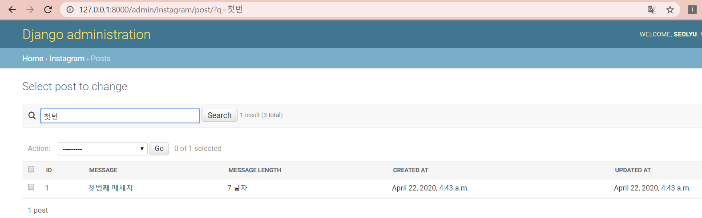


### list_filter 속성 정의

지정 필드값으로 필터링 옵션 제공

```python
from django.contrib import admin
from .models import Item

@admin.register(Item)
class ItemAdmin(admin.ModelAdmin):
    list_display = ['pk', 'name', 'short_desc', 'price', 'is_publish']
    list_display_links = ['name']  # 여러개 가능
    list_filter = ['is_publish']
    search_field = ['name']

    def short_desc(self, item):
        return item.desc[:20]
```

instagram > admin.py

```python
from django.contrib import admin
from .models import Post

@admin.register(Post)
class PostAdmin(admin.ModelAdmin):
    list_display = ['id', 'message', 'message_length', 'created_at', 'updated_at']
    list_display_links = ['message']  # 여러개 가능
    list_filter = ['created_at']
    search_fields = ['message']

    def message_length(self, post):
        # return len(post.message)
        return f"{len(post.message)} 글자"
```

오른쪽에 필터가 추가됨


instagram > models.py 수정

```python
from django.db import models

class Post(models.Model):
    message = models.TextField()
    is_public = models.BooleanField(default=False, verbose_name='공개여부')
    created_at = models.DateTimeField(auto_now_add=True)
    updated_at = models.DateTimeField(auto_now=True)

    # Java의 toString
    def __str__(self):
        # return f"Custom Post object ({self.id})"
        # return "Custom Post object ({})".format(self.id)
        return self.message
    
    # admin단에 구현도 가능함
    # def message_length(self):    # 인자없는 함수만 가능
    #     return len(self.message)
    # message_length.short_description = "메세지 글자수"  # 이름도 변경 가능
```

exit()  빠져나오기

`python manage.py makemigrations instagram`

migrations 폴더에 0002 파일 생성됨

`python manage.py migrate instagram`  // 실제 db에 적용

`python manage.py showmigrations instagram`  // 적용 내역

`python manage.py showmigrations`  // 앱 이름 없이하면 전체 


instagram > admin.py 에 'is_public' 추가

```python
list_display = ['id', 'message', 'message_length', 'is_public', 'created_at', 'updated_at']
```

필터에도 추가

```python
list_filter = ['created_at', 'is_public']
```


## media 파일을 다루는 방법

### Static & Media 파일

#### Static 파일

* 개발 리소스로서의 정적인 파일 (js, css, image 등)
* 앱 / 프로젝트 단위로 저장 / 서빙

#### Media 파일

* FileField / ImageField를 통해 저장한 모든 파일

* DB필드에는 저장경로를 저장하며, 파일은 파일 스토리지에 저장

  실제로 문자열을 저장하는 필드 (중요)

* 프로젝트 단위로 저장 / 서빙


instagram 앱 models.py 에 photo 라는 필드 추가

```python
from django.db import models

class Post(models.Model):
    message = models.TextField()
    photo = models.ImageField(blank=True)
    is_public = models.BooleanField(default=False, verbose_name='공개여부')
    created_at = models.DateTimeField(auto_now_add=True)
    updated_at = models.DateTimeField(auto_now=True)

    # Java의 toString
    def __str__(self):
        # return f"Custom Post object ({self.id})"
        # return "Custom Post object ({})".format(self.id)
        return self.message
    
    # admin단에 구현도 가능함
    # def message_length(self):    # 인자없는 함수만 가능
    #     return len(self.message)
    # message_length.short_description = "메세지 글자수"  # 이름도 변경 가능
```

`pip install pillow`  // 파이썬 이미지 라이브러리 다운

manage.py 있는 경로에 requirements.txt 만들기

```
django~=3.0.0
pillow
```

`pip install -r requirements.txt`  // 한번에 설치됨

pillow 는 버전탈 일이 없어서 이름만 씀

`python manage.py makemigrations instagram`

`python manage.py migrate instagram`

`python manage.py runserver`

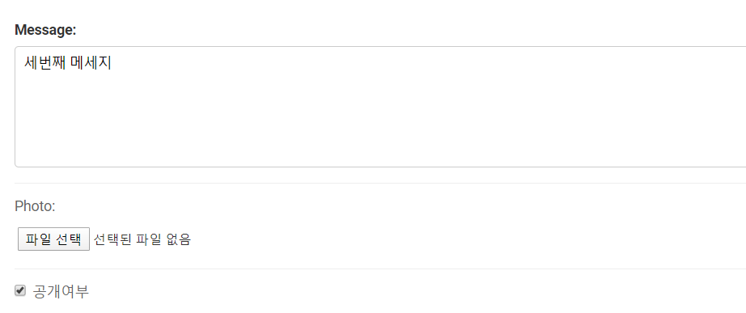

사진 입력 UI가 나옴


### Media 파일 처리 순서

1. HttpRequest.FILES를 통해 파일이 전달
2. 뷰 로직이나 폼 로직을 통해, 유효성 검증을 수행하고,
3. FileField/ImageField 필드에 "경로(문자열)"를 저장하고,
4. settings.MEDIA_ROOT 경로에 파일을 저장


### Media 파일, 관련 settings 예시

#### 각 설정의 디폴트 값

MEDIA_URL = ""

각 media 파일에 대한 URL Prefix

필드명.url 속성에 의해서 참조되는 설정

MEDIA_ROOT = ""

파일필드를 통한 저장 시에, 실제 파일을 저장할 ROOT 경로

아래와 같이 기본 settings

```python
# STATIC_ROOT = ''  # TODO

MEDIA_URL = '/media/'
MEDIA_ROOT = os.path.join(BASE_DIR, 'media')
```

or

```python
# STATIC_ROOT = ''  # TODO

MEDIA_URL = '/media/'
MEDIA_ROOT = os.path.join(BASE_DIR, '..', 'pubilc', 'media')  
# '..' 프로젝트 한 단계 상위 폴더 밑에 public에 media
```


## FileField와 ImageField

#### FileField

* File Storage API를 통해 파일을 저장

  장고에서는 File System Storage만 지원. django-storages를 통해 확장 지원.

* 해당 필드를 옵션 필드로 두고자 할 경우, blank=True 옵션 적용

#### ImageField (FileField 상속)

* Pillow (이미지 처리 라이브러리)를 통해 이미지 width/height 획득

  Pillow 미설치 시에, ImageField를 추가한 makemigrations 수행에 실패함

#### 위 필드를 상속받은 커스텀 필드를 만들 수도 있음

* ex) PDFField, ExcelField 등


### 모델 필드 예시

```python
class Post(models.Model):
    author_name = models.CharField(max_length=20)
    title = models.CharField(max_length=100)
    content = models.TextField()
    photo = models.ImageField(blank=True)
    created_at = models.DateTimeField(auto_now_add=True)
    updated_at = models.DateTimeField(auto_now=True)
```


### 사용할 만한 필드 옵션

blank 옵션

* 업로드 옵션처리 여부
* 디폴트: False

upload_to 옵션

* settings.MEDIA_ROOT 하위에서 저장한 파일명/경로명 결정

* 디폴트 : 파일명 그대로 settings.MEDIA_ROOT 에 저장

  추천) 성능을 위해, 한 디렉토리에 너무 많은 파일들이 저장되지 않도록 조정하기

* 동일 파일명으로 저장 시에, 파일명에 더미 문자열을 붙여 파일 덮어쓰기 방지

프로젝트seolyupjt에 urls.py

```python
"""seolyupjt URL Configuration

The `urlpatterns` list routes URLs to views. For more information please see:
    https://docs.djangoproject.com/en/3.0/topics/http/urls/
Examples:
Function views
    1. Add an import:  from my_app import views
    2. Add a URL to urlpatterns:  path('', views.home, name='home')
Class-based views
    1. Add an import:  from other_app.views import Home
    2. Add a URL to urlpatterns:  path('', Home.as_view(), name='home')
Including another URLconf
    1. Import the include() function: from django.urls import include, path
    2. Add a URL to urlpatterns:  path('blog/', include('blog.urls'))
"""
from django.contrib import admin
from django.urls import path, include

# 아래와 같이 쓰면 안됨
# from seolyupjt import settings
# 왜냐하면
# from django.conf import global_settings 가 합쳐져야하므로
# 위 기본에다가 저 위에 settings 를 overwrite 하는거라서
from django.conf import settings  # 위 두가지 합쳐준거

urlpatterns = [
    path('admin/', admin.site.urls),  # URL Reverse 기능
    path('blog1/', include('blog1.urls')),
    path('instagram/', include('instagram.urls')),
]

settings.MEDIA_URL
settings.MEDIA_ROOT
```


settings.py 에 아까 추가한거

```python
MEDIA_URL = '/media/'  # media 말고 다르게 지정가능. 파일 url 통해 접근할 때
MEDIA_ROOT = os.path.join(BASE_DIR, 'media')  # 파일 저장할 때
```

파일 읽어서 줘야하는데 장고 기본 설정에 그런게 없음

프로젝트 urls.py에

```python
from django.conf.urls.static import static
from django.contrib import admin
from django.urls import path, include

# 아래와 같이 쓰면 안됨
# from seolyupjt import settings
# 왜냐하면
# from django.conf import global_settings 가 합쳐져야하므로
# 위 기본에다가 저 위에 settings 를 overwrite 하는거라서
from django.conf import settings  # 위 두가지 합쳐준거

urlpatterns = [
    path('admin/', admin.site.urls),  # URL Reverse 기능
    path('blog1/', include('blog1.urls')),
    path('instagram/', include('instagram.urls')),
]

settings.MEDIA_URL
settings.MEDIA_ROOT

# DEBUG 참일 때
if settings.DEBUG:
    # url 리스트를 urlpatterns에 추가함
    urlpatterns += static(settings.MEDIA_URL, document_root=settings.MEDIA_ROOT)
```

```python
from django.conf.urls.static import static

# DEBUG 참일 때
if settings.DEBUG:
    # url 리스트를 urlpatterns에 추가함
    urlpatterns += static(settings.MEDIA_URL, document_root=settings.MEDIA_ROOT)
```


instagram 에 admin.py

```python
from django.contrib import admin
from .models import Post

@admin.register(Post)
class PostAdmin(admin.ModelAdmin):
    list_display = ['id', 'photo_tag', 'message', 'message_length', 'is_public', 'created_at', 'updated_at']
    list_display_links = ['message']  # 여러개 가능
    list_filter = ['created_at', 'is_public']
    search_fields = ['message']

    def photo_tag(self, post):
        if post.photo:
            return f''
        return None

    def message_length(self, post):
        # return len(post.message)
        return f"{len(post.message)} 글자"
```

list_display 에 photo_tag 추가하고

함수 추가

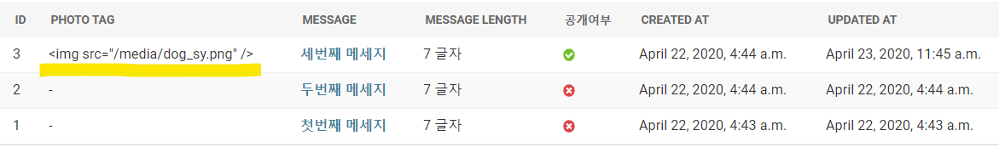

```python
from django.utils.safestring import mark_safe


def photo_tag(self, post):
        if post.photo:
            return mark_safe(f'')
        return None
```

이렇게 하면 이미지 나오는데 큼

```python
def photo_tag(self, post):
        if post.photo:
            return mark_safe(f'')
        return None
```


instagram > models.py

```python
photo = models.ImageField(blank=True, upload_to='instagram/post/%Y/%m/%d/%H/%M/%S')
```

파일을 다시 올려보면

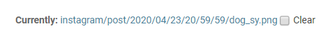

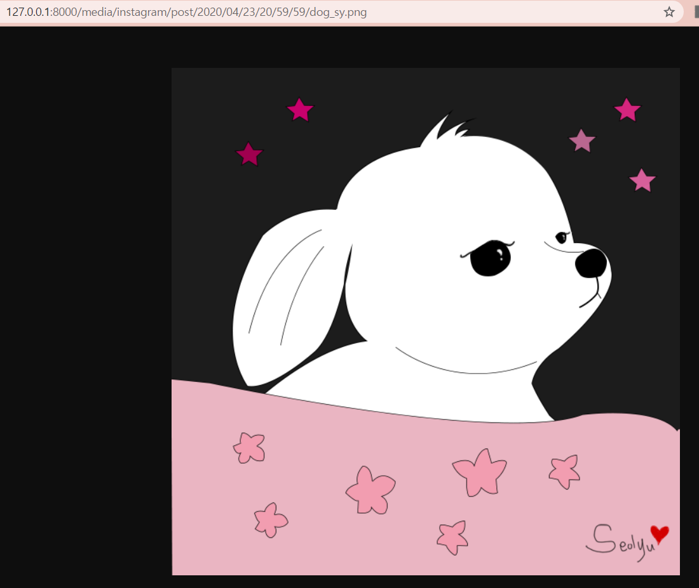

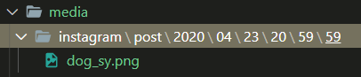


## 파일 업로드 시에 HTML Form enctype

### form method는 필히 POST로 지정

* GET의 경우 enctype이 "application/x-www-form-urlencoded"로 고정

### form enctype을 필히 "multipart/form-data"로 지정

* "application/x-www-form-urlencoded"의 경우, 파일명만 전송


## upload_to 인자

#### 파일 저장 시에 upload_to 함수를 호출하여, 저장 경로를 계산

파일 저장 시에 upload_to 인자를 변경한다고 해서, DB에 저장된 경로값이 갱신되진 않음

#### 인자 유형

* 문자열로 지정

  파일을 저장할 "중간 디렉토리 경로"로서 활용

* 함수로 지정

  "중간 디렉토리 경로" 및 "파일명"까지 결정 가능


## 파일 저장경로

travel-20181225.jpg 파일을 업로드할 경우

MEDIA_ROOT/travel-20181225.jpg 경로에 저장되며,

DB에는 "travel-20181225.jpg" 문자열을 저장함


## 파일 저장경로 / 커스텀

### upload_to 옵션

한 디렉토리에 파일을 너무 많이 몰아둘 경우, OS 파일찾기 성능 저하. 디렉토리 Depth가 깊어지는 것은 성능에 큰 영향 없음.

필드 별로, 다른 디렉토리 저장경로를 가지기

대책1) 필드 별로 다른 디렉토리에 저장

photo = models.ImageField(upload_to="blog")

photo = models.ImageField(upload_to="blog/photo")

대책2) 업로드 시간대 별로 다른 디렉토리에 저장

upload_to에서 strftime 포맷팅을 지원

photo = models.ImageField(upload_to="blog/%Y/%m/%d")


### ex) uuid를 통한 파일명 정하기

```python
import os
from uuid import uuid4
from django.utils import timezone

def uuid_name_upload_to(instance, filename):
    app_label = instance.__class__._meta.app_label  # 앱 별로
    cls_name = instance.__class__.__name__.lower()  # 모델 별로
    ymd_path = timezone.now().strftime('%Y/%m/%d')  # 업로드하는 년/월/일 별로
    uuid_name = uuid4().hex
    extension = os.path.splitext(filename)[-1].lower()  # 확장자 추출하고, 소문자로 변환
    return '/'.join([
        app_label,
        cls_name,
        ymd_path,
        uuid_name[:2],
        uuid_name + extension,
    ])
```


32 글자의 랜덤 문자열

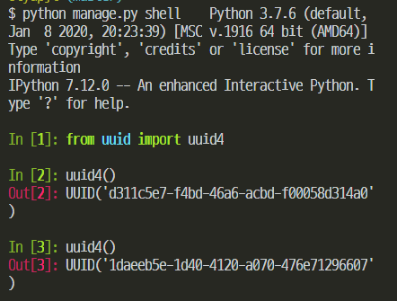

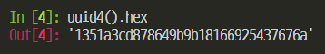


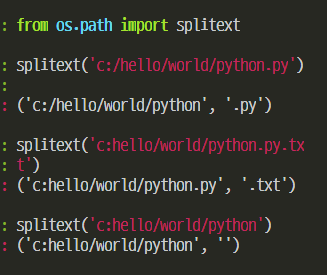

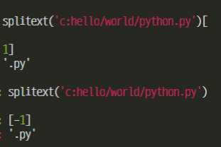


## 템플릿에서 media URL 처리 예시

### 필드의 .url 속성을 활용하기

내부적으로 settings.MEDIA_URL과 조합을 처리

```html

```

필드에 저장된 경로에 없을 경우, .url 계산에 실패함에 유의. 그러니 안전하게 필드명 저장유무를 체크

```html

	

```

참고) 파일 시스템 상의 절대경로가 필요하다면, .path 속성을 활용

settings.MEDIA_ROOT와 조합

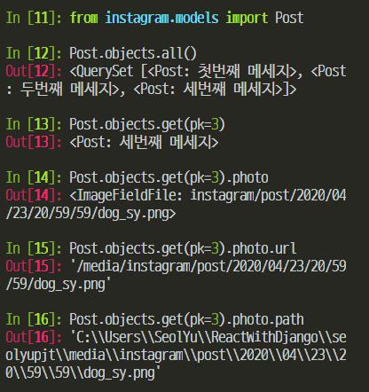

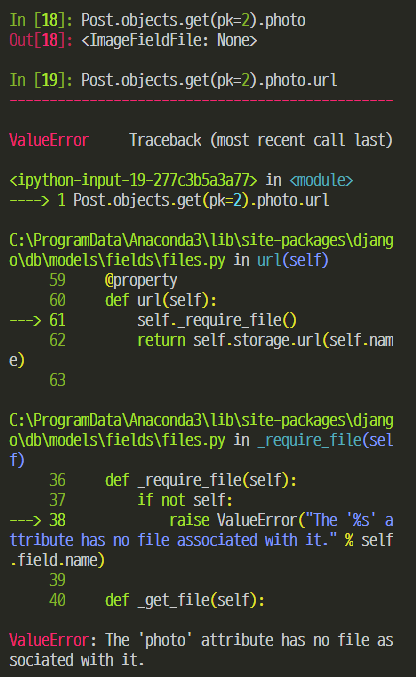


## 개발환경에서의 media 파일 서빙

static 파일과 다르게, 장고 개발서버에서 서빙 미지원

개발 편의성 목적으로 직접 서빙 Rule 추가 기능

```python
from django.conf import settings
from django.conf.urls.static import static

# 중략
urlpatterns += static(settings.MEDIA_URL, document_root=settingsMEDIA_ROOT)
```


## File Upload Handler

(임시 처리. 실제 파일 디스크에 저장하기 전에 유저가 업로드한 파일을 임시적으로 어디에 담아두느냐)

#### 파일크기가 2.5MB 이하일 경우

메모리에 담겨 전달

MemoryFileUploadHandler

#### 파일크기가 2.5MB 초과일 경우

디스크에 담겨 전달

TemporaryFileUploadHandler

#### 관련 설정

settings.FILE_UPLOAD_MAX_MEMORY_SIZE

=> 2.5MB


## 장고 쉘

Python Interactive Shell

기본 파이썬 쉘

* IPython : https://ipython.org/
* Jupyter Notebook with Python Kernel <- IPython 웹버전
* BPython : https://bpython-interpreter.org/

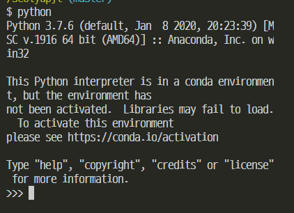

기본쉘


일반 파이썬 쉘에서 장고 프로젝트에 접근하면

`>>> python`

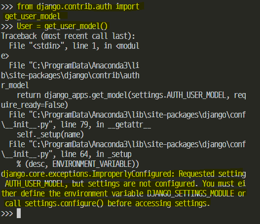


장고 프로젝트 설정이 로딩된 파이썬 쉘

쉘> python manage.py shell

우선순위 : ipython 쉘, bpython 쉘, python 쉘

옵션

-i (--interface) : 인터프리터 인터페이스 커스텀 지정

-c (--command) : 실행할 파이썬 코드를 문자열로 지정

```
개발환경에서는 ipython 쉘 추천
서비스 환경에서는 쉘을 띄우지 않음
```

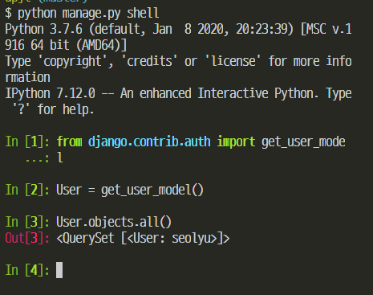


`conda install jupyter`  // 주피터 노트북이 설치되면서 IPython 같이 설치됨

`ipython`

`python manage.py shell`

`jupyter notebook`


### --command 옵션 활용

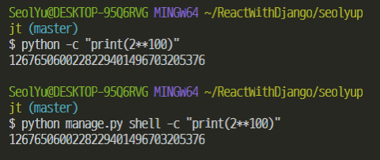

### --command 옵션과 유사한 활용

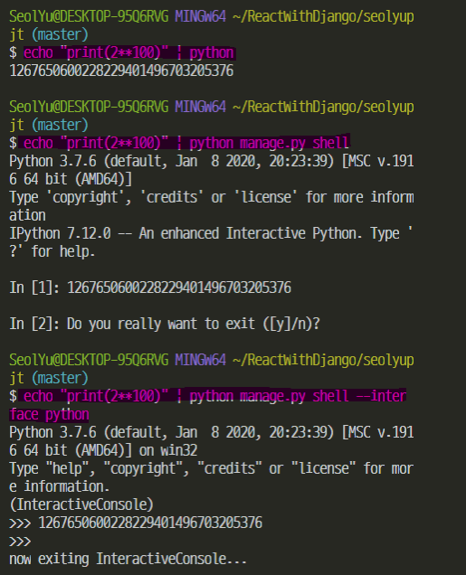


파이썬 코드에서도 번거로우나, 가능

```python
import os
# DJANGO_SETTINGS_MODULE 환경변수 미지정 시에, "seolyupjt.settings"로 지정하겠다는 의미
os.environ.setdefault('DJANGO_SETTINGS_MODULE', 'seolyupjt.settings')

# 다른 경로에 장고 프로젝트가 있다면
# import sys
# sys.path.insert(0, '장고 프로젝트 경로')

import django
django.setup()  # 장고 프로젝트 셋업

# 이제 현 장고 프로젝트에 대한 모든 리소스에 접근 가능
from django.contrib.auth import get_user_model

User = get_user_model()
print(User.objects.all())
```


manage.py 에 가보면

```python
#!/usr/bin/env python
"""Django's command-line utility for administrative tasks."""
import os
import sys


def main():
    os.environ.setdefault('DJANGO_SETTINGS_MODULE', 'seolyupjt.settings')
    try:
        from django.core.management import execute_from_command_line
    except ImportError as exc:
        raise ImportError(
            "Couldn't import Django. Are you sure it's installed and "
            "available on your PYTHONPATH environment variable? Did you "
            "forget to activate a virtual environment?"
        ) from exc
    execute_from_command_line(sys.argv)


if __name__ == '__main__':
    main()

```

여기서

```python
os.environ.setdefault('DJANGO_SETTINGS_MODULE', 'seolyupjt.settings')
```

장고가 시작될 때 꼭 필요한 환경 변수

장고 settings 위치 알려달라는

장고에 필요한 설정을 읽어들임

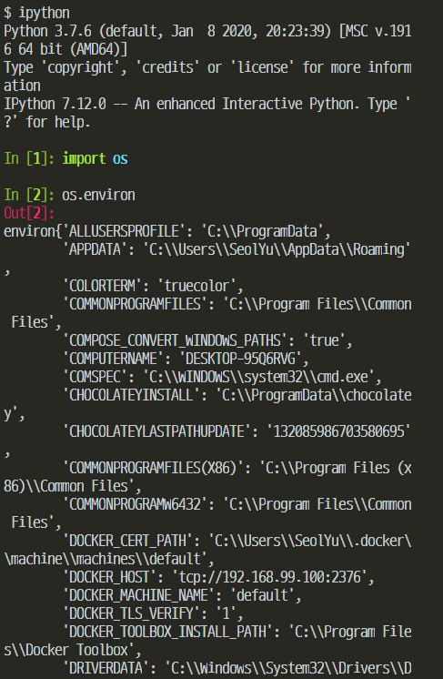

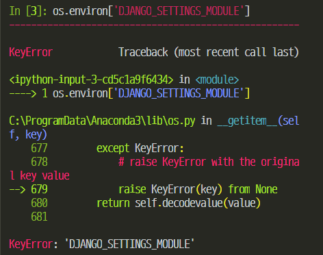

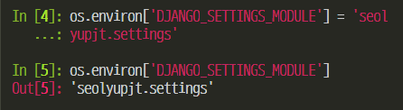

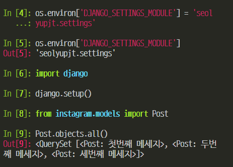


`jupyter notebook`

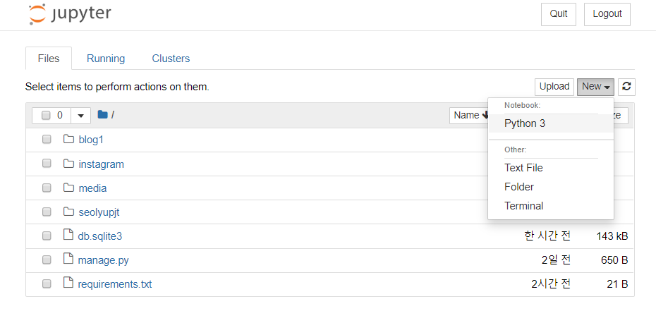

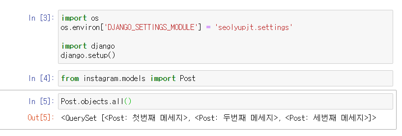

django2는 되는데 django3는 Asynchronous support

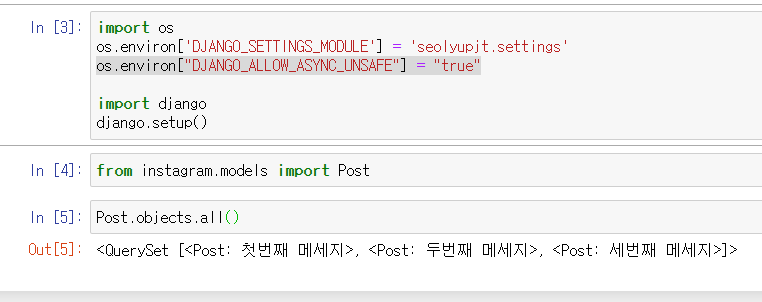

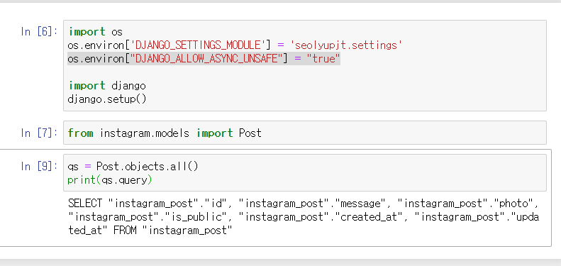


---------------------------

✌︎('ᴗ'✌︎ ) ✌︎('ᴗ')✌︎ ( ✌︎'ᴗ')✌︎

